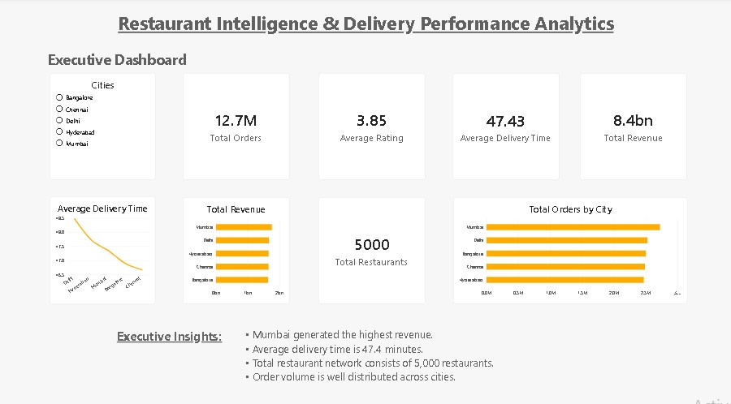
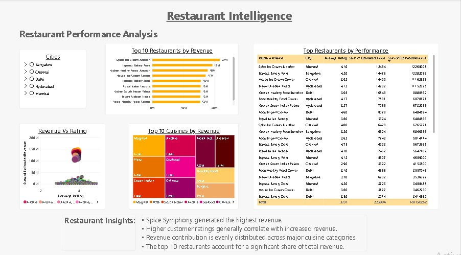
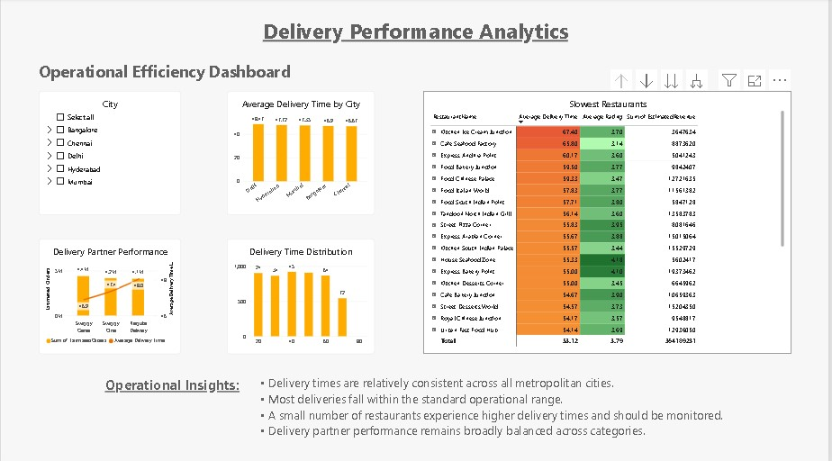
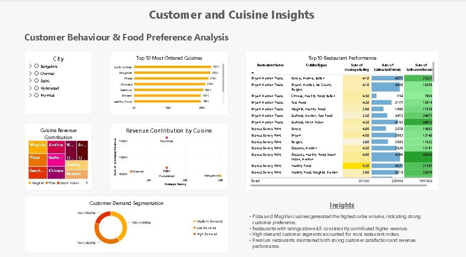

# 🍽️ Restaurant Intelligence & Delivery Performance Analytics

> **End-to-End Business Intelligence Project using SQL Server & Power BI**

---


## 📌 Project Overview

This project analyzes restaurant performance, customer behavior, delivery efficiency, and revenue trends using SQL Server and Power BI.

The objective is to transform raw restaurant data into meaningful business insights through SQL-based analytics, interactive dashboards, and executive-level reporting.

---

## 🎯 Business Problem

Food delivery platforms generate large volumes of operational data every day.

This project aims to answer key business questions such as:

- Which cities generate the highest revenue?
- Which restaurants perform the best?
- Which cuisines are most preferred?
- How does delivery time impact customer satisfaction?
- Which factors contribute to higher revenue?

---

## 🛠️ Technology Stack

- Microsoft SQL Server
- SQL Server Management Studio (SSMS)
- Microsoft Power BI
- Microsoft Excel
- DAX
- GitHub

---

## 📊 Dashboard Pages

---

# 📸 Dashboard Preview

## Executive Overview



---

## Restaurant Intelligence



---

## Delivery Performance Analytics



---

## Customer & Cuisine Insights



### Executive Overview

Business KPIs including:

- Total Revenue
- Total Orders
- Average Rating
- Average Delivery Time
- Total Restaurants

---

### Restaurant Intelligence

Restaurant-level analysis including:

- Top Restaurants
- Revenue Analysis
- Rating vs Revenue
- Cuisine Contribution

---

### Delivery Performance Analytics

Operational insights including:

- Delivery Time Analysis
- Delivery Partner Performance
- Delivery Time Distribution
- Slowest Restaurants

---

### Customer & Cuisine Insights

Customer behavior analysis including:

- Most Ordered Cuisines
- Restaurant Performance
- Customer Demand Segmentation
- Cuisine Revenue Contribution

---

## 💼 Key Business Insights

- Mumbai generated the highest overall revenue.
- Premium-rated restaurants consistently generated higher revenue.
- Pizza and Mughlai cuisines attracted the highest customer demand.
- Average delivery time remained approximately 47 minutes.
- Customer purchasing behavior was influenced more by restaurant quality than discount percentage.

---

## 📈 Skills Demonstrated

- SQL Query Writing
- Data Cleaning
- Data Transformation
- Business Intelligence
- Dashboard Design
- Data Visualization
- DAX
- Business Storytelling

---

## 📂 Repository Structure

```text
Dashboard/
Documentation/
Dataset/
SQL/
Assets/
```
---

## 👨‍💻 Author

**Dommeti David James Paull**

**Aspiring Data Analyst**

📍 India

### Connect with me

- GitHub: https://github.com/Dommeti-David
- Email: dommeti.david@gmail.com
- LinkedIn: *(We'll add this once your LinkedIn profile is ready.)*
4. :contentReference[oaicite:4]{index=4}.

  ---

# 📥 Project Files

- 📊 Power BI Dashboard (`Dashboard/Restaurant Intelligence & Delivery Performance Analytics.pbix`)
- 🗄️ SQL Scripts (`SQL/`)
- 📄 Project Documentation (`Documentation/`)
- 📂 Dataset (`Dataset/`)
